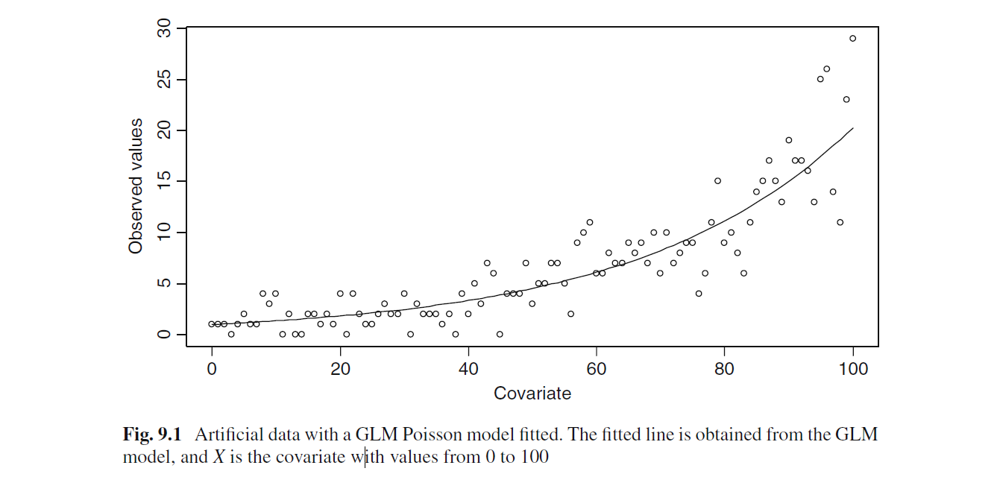
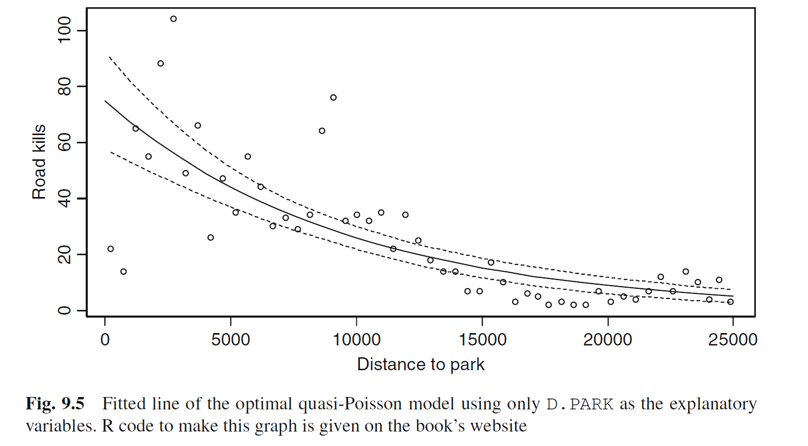

```{r setup, include=FALSE}
knitr::opts_chunk$set(echo = TRUE)
```

Load useful Zuur functions.

```{r}
source("R/HighstatLibV10.R")
```

#Chapter 9: GLM and GAM for count data

##Previous chapter summary:

Last week Josh covered the exponential familiy for glms and how different distributions on the response variable and different link functions can be used to apply regression to a range of different data types and/or relationships between the response and the predictor variables.

##This week!

This week I'll be diving into the poission and negative-binomial families for the use of modelling count data, something that is highly prevalent in ecology!


##Gaussian linear regression as a GLM

To recap, a GLM consists of three steps;  
  
  1. An assumption about how _Yi_ is distributed, including it's mean and variance structure.
  2. Specification of the model in terms of the explanatory variables
  3. The link between the mean of _Yi_ and the specified combination of explanatory variables.
  
A gaussian GLM is essentially the same as a simple linear regression model, and can be used to model count data in some cases.
  
  However, the residuals in this approach are typically heterogenous. And while there are options to solve this through using generalised least squares or (you guessed it) transforming the data, the versatility of the GLM allows us to specify models that are able to directly model count data.
  
##The poisson GLM

To recap, the poisson family of GLM is specified as;
  
  1. _Yi_ being distributed with mean _Ui_, with the variance of _Yi_ also being equal to _Ui_
  2. The systematic part is essentially the same, just with different letters here and there.
  3. There is a log link between the mean of _Yi_ and the predictor function.
  
The poisson GLM (pGLM) is useful for count data as count data tends to be heretogenous (which is dealt with somewhat by the variance being equal to the mean) and are always non-negative (allowing for the log-link, which would otherwise throw an error if negative values were included)

Here's a plot of a pGLM ran on simulated data with an intercept of 0.01 and slope of 0.03:
  
  

Note how the spread of the data increases with the covariate and also how the pGLM fits _y_ values that are non-integer, whereas the observed values are all integers as they are counts.  
  
##Likelihood criteron 
  
The two parameters being estimated by the pGLM are the same as the linear regression; namely the slope and intercept.  
  
  For linear regression, ordinary least squares is used to estimate these parameters by minimising the residual sum of sqaures. Basically it finds the line that minimises the total vertical distances between the line and the observed values. For pGLM's a technique call maximum likelihood estimation is used instead.
  
  The likilihood criterion _L_ is  the joint probability of observing each value of _Yi_ from the fitted values _yi_. Assuming that each value of _Yi_ is independant of one another, _L_ can be specified as the probabiity of _Y1_ multipled by the probablity of _Y2_ and so on to _Yn_.
  
  So _L_ is in a sense the joint probability of observing _Yi_, and maximum likelihood estimation is an interative process that attempts to fit the parameters (in this case the slope and intercept) in a way that maximises _L_.
  
  This process doesn't have a simple closed form solution, and instead the equations are solved interatively using an Iteratively Reweighted Least Squares algorithm, and the number of iterations is printed with the model output in R. To speed up the calcuation of _L_, the parameters are log transformed, resulting in a log-likelihood parameter.
  
##pGLM with a real example.

###The data

```{r}
data(RoadKills)
RK <- RoadKills
```  

The data used in the example is a count of amphibian roadkills across 52 sites in Portugal, along with site level data that may be possible explanatory variables. For example, the number of roadkills observed may be explained distance to a natural park, presumably as there would be more amphibians closer to the parks.

```{r}
plot(RK$D.PARK,RK$TOT.N,xlab="Distance to park",
     ylab="Road kills")
```

The relationship appears non-linear and the variation in _Yi_ changes with _X_ and  _Yi_ is count data. These factors make it a good example of data for a pGLM, although Zuur states that the actual way to approach this problem may not be a pGLM once other explanatory variables are considered.  
  
  Returning to the three steps, this problem can be stated as:
    
  1. _Yi_ (the number of animals killed at site _i_), is poisson distributed.
    
  2. The systematic part is given by _a_ + _B_ x _Xi_ (Distance to park)
  
  3. There is a log link between the mean of _Yi_ and the predictor variables.
    
###The analysis

####Running the model

Fitting a pGLM gives us:

```{r}
M1<-glm(TOT.N~D.PARK,family=poisson,data=RK)
summary(M1)
```

The model parameter estimates are 4.32 for the intercept and -0.0001 for the slope. Note that here z-scores are used for hypothesis testing as the variance is known, whereas t-scores are used for linear regression as the varience is estimated.

####Deviance

Towards the bottom of the model summary are the terms null deviance and residual deviance. These deviances are kind of like the maximum likelihood equivalents of the total sum of squares and residual sum of squares that are found in linear regression (think R-squared).
  
  For pGLM the residual deviance is defined as twice the difference between the log-likelihood of a saturated (or perfectly fitted) model and the specified model.
  
  The null deviance is the residual deviance in the intercept-only (or worst possible) model
  
  There is no _R^2^_ in a GLM, but a similar metric is the explained deviance (also known as a pseudo _R^2^_), defined as:
  
  $$100 * \frac{null deviance - residual deviance}{null deviance}$$
  Plugging in the values from out model summary we get:
  
  $$100 * \frac{1071.4 - 390.9}{1071.4} = 63.51$$
  
  So, distance explains 63.51% of the observed variation in road kills.
  
  While this is useful, there is some controversy around the use of residual deviance and psuedo _R^2^_ as indicators of model fit.
  
####Plotting the fitted values.

We can use the predict function in R to generate fitted/predicted values. To show how well the model fits the observed data, values should be predicted on the scale of the response variable, after taking the exponential.

```{r}
MyData=data.frame(D.PARK=seq(from=0,to=25000,by=1000))
G<-predict(M1,newdata=MyData,type="link",se=T)
F<-exp(G$fit)
FSEUP<-exp(G$fit+1.96*G$se.fit)
FSELOW<-exp(G$fit-1.96*G$se.fit)
plot(RK$D.PARK,RK$TOT.N,xlab="Distance to park",
     ylab="Road kills")
lines(MyData$D.PARK,F,lty=1)
lines(MyData$D.PARK,FSEUP,lty=2)
lines(MyData$D.PARK,FSELOW,lty=2)
```

Note that the line is curved and the confidence bands increase with larger fitted values. Also, for smaller values there seems to be residuals below and above the fitted values in groups, which may be problematic.

##Model Selection in a GLM

Model selection with a single explanatory variable doesn't make much sense. However, there are many more potential explanatory variables not included in the model (17 in total). 
  
  Some of these are square root transformed due to large values, and a sub-selection of nine variables is used (selected based on variance inflation factors, something we might get to in chapter 16). Nine variables on 52 data points is still quite high in terms of variables though.
  
  We then fit a model using these nine variables, and include no interactions on the basis that there are (apparently) no reasons to expect interaction effects.
  
###Fitting the model

```{r}
RK$SQ.POLIC<-sqrt(RK$POLIC)
RK$SQ.WATRES<-sqrt(RK$WAT.RES)
RK$SQ.URBAN<-sqrt(RK$URBAN)
RK$SQ.OLIVE<-sqrt(RK$OLIVE)
RK$SQ.LPROAD<-sqrt(RK$L.P.ROAD)
RK$SQ.SHRUB<-sqrt(RK$SHRUB)
RK$SQ.DWATCOUR<-sqrt(RK$D.WAT.COUR)
M2<-glm(TOT.N~OPEN.L+MONT.S+SQ.POLIC+
         SQ.SHRUB+SQ.WATRES+L.WAT.C+SQ.LPROAD+
         SQ.DWATCOUR+D.PARK,family=poisson,data=RK)
summary(M2)
```

Most, but not all,of the variables are significant, and it may be a good idea to reduce the number of variables needed to explain the data. This can be done using selection critera such as AIC/BIC, or though a hypothesis testing approach.
  
###Options for finding the optimal model

The hypothesis testing approach can be done in three possible ways:
    
  1. Use Z-tests to assess the probability that the coefficient for a variable = 0. From the previous model summary, the SQ.DWATCOUR variable is the least significant (The p value is 0.131, the largest of all the variables).
    
  2. Use the drop1 function with a chi-squared test, which drops a single term at a time and applies an analysis of deviance test to the full model
    
  3. Use the anova command, which drops terms sequentially, applying an analysis of deviance test at each step.
    
    Approaches 2 & 3 are specified below, and are broadly similar to the use of the drop1 and anova functions for linear regression, except rather than _F_ tests based on residual sum of squares, the residual deviance is used instead.
    
    
###Option 2. The drop1 function

Here the drop1 function drops one term at a time from the model and tests if the differences in the resdidual deviances between the two models is significantly different from 0.


```{r}
drop1(M2,test="Chi")
```

  By specifying test = "Chi", the function compares the difference in residual deviance to a chi-squared distribution for hypothesis testing.
  
  From this we could suggest dropping the SQ.DWATCOUR and the OPEN.L variables, but should do so one at a time and then running the drop1 function again. Also note the AIC values, in particular D.PARK which appears to be very important.
  
  The p-values here are close to the values from the _Z_ statistic in the model summary, but not exactly. However, the analysis of deviance test has the benefit of being able to give p-values for categorical variables.
  
###Option 3. The Anova function.
  
Here, we specify two models, the full model and the model with a term dropped, and again specify the test to compare to a chi-squared distribution.

```{r}
M3 <- glm(TOT.N ~ MONT.S + SQ.POLIC + D.PARK +
          SQ.SHRUB + SQ.WATRES + L.WAT.C + SQ.LPROAD +
          SQ.DWATCOUR, family = poisson, data = RK)
anova(M2, M3, test = "Chi")
```
  
  M3 dropped the OPEN.L term, and the output of the Anova function gives the same p-value as the drop1 function.
  
  It is possible to use the command anova(M2), which is similar to the drop1 function. However, it drops each term sequentially, and so the order of the terms specified in the model will change the output!
  
###Results

On the basis of the drop1 function, removing SQ.DWATCOUR resulted in all the other variables being significant at the 5% level. However, looking back the model summary there is a sentance that says; "overdispersion parameter for Poisson family taken to be 1". Overdispersion isn't actually 1, it was just assumed to be during the model fitting process. So what if overdispersion isn't 1?

##Overdispersion

Overdispersion means that the variance is larger than the mean. To see if this is the case with the specified model you divide the residual deviance by the residual degrees of freedom.
  
  In this case it is 270.22 divided by 42, which equals 6.43. If this ratio is above 1 (which in our case it clearly is), there is evidence for overdispersion. The model previously used didn't take into account this overdispersion, and so the results are likey to be misleading.
  
###Causes and solutions for overdispersion

Hilbe (2007) suggests that there are actually two types of overdispersion; real and apparent.
  
  
  Apparent overdisperion is due to missing covariates and interactions, an incorrectly specifed model, outliers and other sources of missing information. In these cases, the response variable appears overdispersed, but might actually not be once the nessecary corrections are made.
  
  Real overdispersion is when none of the previous sources of overdispersion are able to be identified, there is correlation between observations (violation of independance), there are large numbers of zeros or because the data is genuinely overdispersed.
  
  One quick-fix solution for dealing with overdispersion is to transform the data... just kidding, it's actually to use a quasi-Poisson GLM (q-pGLM).
  
  The diffference between a pGLM and q-pGLM is that with a q-pGLM the Poisson distribution is no longer explicitly specifed, only the relationship between the mean and variance.
  
  A Poisson distribution is still possible with a q-pGLM when the dispersion parameter = 1. If it is above 1 there is overdispersion and if it is less than 1 there is underdispersion (i.e. the variance around the mean is smaller than expected from a Poisson distribution).
  
  The cost of specifing an overdispersion parameter above 1 is that the standard errors of the parameter estimates are multiplied by the square root of the overdispersion a parameter. So if it is equal to 9, the standard errors are multipled by 3. This means that the parameters become less significant, which has an impact on the conclusions drawn.
  
```{r}
M4<- glm(TOT.N ~ OPEN.L + MONT.S + SQ.POLIC+
         SQ.SHRUB + SQ.WATRES + L.WAT.C + SQ.LPROAD+
         SQ.DWATCOUR + D.PARK, family = quasipoisson, data = RK)
summary(M4)
```

  While the family option in the glm function has been set to "quasipoisson", it is not actually a quasi-poisson distribution, as it doesn't exist!
  
  Also, the p-values have changed dramatically, suggesting that far fewer variables are significant once overdispersion is accounted for.
  
  The dispersion parameter is no longer taken to be 1, but 5.92.
  
  And... there is no AIC calculated, which precludes it's use for model selection.
  
####Model selection in quasi-poisson

Model selection in this case is similar to a pGLM. As noted, AIC is not calculated, and so any functions that rely on AIC for selection are unavailable.
  
  Hypothesis tests are still available however, and they use the _F_ statistic rather than the chi-squared test.

```{r}
drop1(M4,test="F")
```

  Again, we drop the least significant term first, and continue to do so until only significant terms are left in the model. These variables were dropped in order; OPEN.L, SQ.WATRES, SQ.LPROAD, SQ.SHRUB, SQ.POLIC, MONT.S, and L.WAT.C.
  
  In fact, the only term left was D.PARK, resulting in a very different interpretation of results.
  
  The plot of the model fit appears very similar to the pGLM that only included D.PARK, however the confidence bands are much wider in the q-pGLM case.




##Model validation in a Poisson GLM

Looking at the plots of the fitted values, it's easy to see that the weighting of the residuals is dependant on the predictor function. Namely, high values of D.PARK will be highly likely to have smaller residuals than lower values.
  
  This makes typical residual plots not very useful, however it is possible to account for this.
  
###Pearson residuals

In this case, we can divide the residuals by the square root of the variance for that observation, known as Pearson residuals, named because the sum of squares of these transformed residuals gives the Pearson Chi-square goodness of fit critera.
  
  As the variance in a pGLM varies with _Yi_, the Pearsons residuals account for the issue of residual size being tied to the predictor function.
  
###Deviance residuals

Residual deviance is similar to the residual sum of squares, where understanding each observation's contribution to the total residual deviance is a useful excercise.
  
  This allows us to identify observations that are not well fitted by the model.
  
###Which to use?

So there are three types of residual dicussed so far;
  
  1. Ordinary residuals
  2. Pearson residuals
  3. Deviance residuals
  
  R, by default, uses deviance residuals and in most cases they are not very different from Pearson residuals. However this is not the case when data are zero inflated, or for Binomial GLMs. 
  
  Regardless, it should be noted that we are using these residuals to identify lack of fit and patterns in the residuals, not checking for normality as is typically done for linear regression.
  
###What to plot?

The residuals should be plotted against the following and checked for patterns:
  
  Fitted values: Patterns in the spread of residuals may suggest overdispersion and/or the wrong mean-variance relationship.
  
  Each variable included in the model: If there are patterns visible, then including a quadratic term or using a GAM might help, alternatively conclude a violation of independance.
  
  Each variable not included in the final model: If there is a pattern, then include it in the model
  
  Time/spatial coordinates: Patterns here suggest a violation of independance.

  Violations of independance usually means that an important co-variate has been excluded from the model. The solution to this is either to go back and measure it (if possible) or to pray that a GLMM or other approache offsets this violation.
  
##Illustration of model validation using the optimal q-pGLM model.

Using the standard plot function gives us familiar plots previously seen in the linear regressions.

```{r}
M5<-glm(TOT.N~D.PARK,family=quasipoisson,data=RK)
plot(M5)
```

  Note that we can still take advantage of the Cook's distance and leverage scores in a q-pGLM for identifying outliers/influential points.
  
  These initial plots suggest that there is a pattern in the residuals and points towards a potential violation of independance.
  
  To plot the Pearsons and deviance residuals, we have to calculate them manually first.

```{r}
EP=resid(M5,type="pearson")
ED=resid(M5,type="deviance")
```

The resid function calculates the residuals. However, the function ignores the overdispersion parameter so we need to manually divide the Pearson residuals by the square root of the disperson parameter (7.63):

```{r}
mu=predict(M5,type="response")
E=RK$TOT.N-mu
EP2=E/sqrt(7.630148*mu)
```

We are then free to plot the residuals.

```{r}
op <- par(mfrow=c(2,2))
plot(x=mu,y=E,main="Response residuals")
plot(x=mu,y=EP,main="Pearson residuals")
plot(x=mu,y=EP2,main="Pearson residuals scaled")
plot(x=mu,y=ED,main="Deviance residuals")
par(op)
```

  You can see that the Pearson and deviance residuals are very similar in this case and that there is a clear pattern, so there is still something missing from our model!
  
##The negative binomial GLM

One of the mentioned downsides of the q-pGLM is that it multiplies the standard errors and has an effect on the test statistics derived from the model. However, the negative binomial GLM (nbGLM) provides an alternative approach.
  
  Again, the mean and variance of _Yi_ are linked, in this case by the parameter _k_, where the variance of _Yi_ is equal to the mean plus the mean squared divided by _k_.
  
  The _k_ parameter essentially acts like an overdispersion parameter and is estimated during the fitting process.
  
  Again, the systematic part is specified as usual and again there is a log link between the mean of _Yi_ and the predictor function.
  
  Also like the pGLM, the nbGLM uses maximum likelihood estimation for deriving paramter estimates based on the likelihood criterion based on the negative binomial probability function (See Chapter 8 again for more details.)
  
  The result is a log-likeliood criterion used in the iterative parameter estimating step when fitting the model.
  
###Fitting the model

The nbGLM function is not automatically included in the R glm function, so instead we load the MASS package, and then fit the first model including all 11 variables.

```{r}
library(MASS)
M6<-glm.nb(TOT.N~OPEN.L+MONT.S+SQ.POLIC+
         SQ.SHRUB+SQ.WATRES+L.WAT.C+SQ.LPROAD+
         SQ.DWATCOUR+D.PARK,link="log",data=RK)
summary(M6)
```

  The output of the summary function is similar to the pGL, except there is the parameter theta included, which is the _k_ parameter used for the variance calculation.
  
  Many of the variables have been highlighted as being non-significant, so model selection is required.

###Model selection on nbGLM

Similar tools are available for nbGM as for pGLM, namely AIC comparison and hypothesis testing. The availability of likelihood metrics such as AIC is an advantage of using nbGLM over q-pGLM.  
  
###Model results

The complete process of model selection isn't presented here, but follows the same track as for pGLM.
  
  The final nbGLM contains both OPEN.L and D.PARK
  
  
```{r}
M8<-glm.nb(TOT.N~OPEN.L+D.PARK,link="log",data=RK)
summary(M8)
drop1(M8,test="Chi")
```

The model suggests that the further away from a natural park, the fewer the number of roadkills, as does open land cover.  
  
  Plotting the residuals highlights no pattern compared to the q-pGLM

```{r}
par(mfrow=c(2,2))
plot(M8)
```

  If there was still a pattern in the residuals, it is possible to apply a test to select either the nbGLM or q-pGLM as they are nested.
  
  To do this, we can use a likelihood ratio test of the variances where the null hypothesis states that the two models should have the same variance.
  
```{r}
M9 <- glm(TOT.N ~ OPEN.L + D.PARK, family = poisson, data = RK)
llhNB = logLik(M8)
llhPoisson  = logLik(M9)
d <- 2 * (llhNB - llhPoisson)
pval <- pchisq(as.numeric(d), df=1, lower.tail=FALSE)/2
d
pval
```

  The test statistic is equal to 244.66 and the resulting p-value (which was divided by two as we are testing on the boundary) was <0.001.
  
  This means there is strong support for the nbGLM being the better model of the two.
  
  
  
  

  

  .