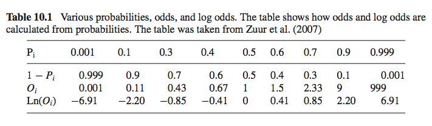

```{r setup, include=FALSE}
knitr::opts_chunk$set(echo = TRUE)
```

Load useful Zuur functions.

```{r}
source("R/HighstatLibV10.R")
```

## Recap and Outline 

Chapter 9: analyses of count data with no upper limit, using Poisson GLM and negative binomial GLM.

This chapter: 

*logistic regression = GLM for binary data (0/1, presence/absence)

*GLMs for proportional data

## GLM for presence/absence data

### Example 1: tuberculosis in wild boar

Model the probability that a wild boar has TB as a function of the animal's length.  Age would be another possible explanatory variable, but it's collinear with length and happens to be unbalanced in this data set (76% of the boars are either 3 or 4 years old, 2% are 1 year old).

Start by looking at the data.

```{r}
data(Boar)
#Linear regression:
B0 <- lm(Tb ~ LengthCT, data = Boar)
MyData <- data.frame(LengthCT = seq(from = 46.5, to = 165, by = 1))
Pred <- predict(B0,newdata = MyData, type = "response")
par(mfrow=c(1,2))
boxplot(LengthCT ~ Tb,data=Boar, xlab="TB", ylab="LengthCT")
plot(x=Boar$LengthCT, y = Boar$Tb,xlab="Length", ylab="Tb")
lines(MyData$LengthCT,Pred)
par(mfrow=c(1,1))
```
We see there's some tendency for boars with TB to be longer.  Hard to see much in the plot on the right because TB is only 0 or 1.  The line on the right is the line fitted by a linear regression - but the interpretation is strange, because it's not meaningful for TB to have a value other than 0 or 1.  The linear regression model doesn't really correspond to the reality.

So instead, we model a boar having TB or not as a Bernoulli (coin flip), and say that the probability animal~i~ having TB is $\pi$~i~, and the probability it doesn't have TB is 1 - $\pi$~i~.  This would make sense if we could relate length to the probability of having TB.

A second problem with the linear regression line in the plot above is that there is nothing to keep it from going below 0 or above 1, but the probability $\pi$~i~ has to be between 0 and 1.  What the 'generalized' in 'generalized linear model' means is that we're going to model a function of the response variable Y~i~ instead of Y~i~ directly, and that function will have desired properties - in this case, it'll force the probability to be between 0 and 1.

A binomial GLM is specified with the same 3 steps as in chapter 9 for the Poisson and negative binomial GLMs:

1. Assume a distribution for the response variable Y~i~.  In this case, Y~i~ is 1 if the boar has TB and 0 otherwise.
2. Specify the systematic part, i.e. the fixed part, i.e. the part to the right of the tilde ~ in the formula.
3. Choose a relationship ("link") between the mean value of Y~i~ and the systematic part.

In more detail:

1. For the presence/absence of TB in boars, assume Y~i~ is binomial distributed with probability $\pi$~i~ and n~i~=1 trials (equivalent to Bernoulli($\pi$~i~)).
2. We're using length as the only predictor, so the systematic part of the model is $\eta$(LengthCT~i~) = $\alpha$ + $\beta$ * LengthCT~i~.
3. We need a function that maps values of $\eta$ to between 0 and 1.  The most commonly used one, and the default, is the logit link (other options include probit link, clog-log link, and log-log link).

The logit link:
Define odds as O~i~ = $\pi$~i~ / (1 - $\pi$~i~)
Odds are commonly used in betting; for example, if the odds that a horse will win a race are 9 to 1, that means in 10 races, you expect the horse will win 9 times and lose once.  Alternately, the probability the horse will win is 9 / 10; this is the same thing as saying the odds are 9.  The advantage of using odds is that there's no upper bound; they range from 0 to infinity.

Now about that lower bound, which should be negative infinity, rather than 0: if we take the natural log of the odds, the result will range across the entire number line.  Examples of different probabilities, odds, and log odds are given in the table below.



So what we'll do in a logistic regression, instead of modelling the 0/1 outcome as a linear function of the predictor variables, is model the log odds as a linear function of the predictors:

log(O~i~) = $\eta$(LengthCT)
or we can write logit($\pi$~i~) instead of log(O~i~).  

So the binomial GLM for the TB data is

>Y~i~ ~ Bin(1, $\pi$~i~)

>E(Y~i~) = $\pi$~i~ , var(Y~i~) = $\pi$~i~ * (1 - $\pi$~i~)

>logit($\pi$~i~) = $\alpha$ + $\beta$ * LengthCT~i~

And we can rewrite this to get the probability $\pi$~i~ directly:

>$\pi$~i~ = exp($\alpha$ + $\beta$ * LengthCT~i~) / (1 + exp($\alpha$ + $\beta$ * LengthCT~i~))

Fitting a logistic regression/binomial GLM to the boar TB data:

```{r}
B1=glm(Tb ~LengthCT, family = binomial, data = Boar)
summary(B1)
```

The estimated slope and intercept are -3.89 and 0.03 and are both significant at the 0.05 level.  So the probability that a boar of LengthCT~i~ is infected is

>$\pi$~i~ = exp(-3.89 + 0.03 * LengthCT~i~) / (1 + exp(-3.89 + 0.03 * LengthCT~i~))

To see the relationship between LengthCT~i~ and $\pi$~i~, we can fill in values for the length and manually calculate $\pi$~i~ or use the predict command below.  We predict probabilities for lengths ranging from 46.5 to 165 cm, because those are the range of values observed in the animals.  The dots in the plot are the TB status of the observed animals.

```{r}
MyData <- data.frame(LengthCT = seq(from = 46.5, to = 165, by = 1))
Pred <- predict(B1,newdata = MyData, type = "response")
plot(x=Boar$LengthCT, y = Boar$Tb,xlab="Length", ylab="Tb")
lines(MyData$LengthCT,Pred)
```

The fitted line shows a sigmoid curve, and the fitted values for the probability of having TB are always between 0 and 1.  The probability of observing a boar with TB is low for small animals, increases more rapidly from length about 70-80 cm up to about 140cm, and then increases more slowly for larger animals.

Plotting residuals etc. is very different for logistic regression than for linear, and harder to interpret.  Previously we've always said "there should be no pattern in the residuals", but there are going to be bands in these residuals - the observed data is 1s and 0s and the predictions are probabilities.  If the data set is large, Zuur et al. say "It may be an option to extract the residuals, group them into sets of, say, 10, calculate the average of the residuals per group, and use the averages in graphical validation plots.  The groups can be based on the order of the fitted values, or on the order of a covariate."
But drop1 indicates our one predictor variable is important.

```{r}
par(mfrow=c(2,2))
plot(B1)
summary(B1)
drop1(B1, test="Chi")
```

#### Other link functions

Other link functions can be used in addition to the logit function above.  They will change the shape of the fitted line in the plot above a little bit - see below.

```{r, echo=F}
Pred <- predict(B1,newdata = MyData, type = "response")
plot(x=Boar$LengthCT, y = Boar$Tb,xlab="Length", ylab="Tb")
lines(MyData$LengthCT,Pred)
#Other link functions
B1.A=glm(Tb ~LengthCT, family = binomial(link="probit"), data = Boar)
B1.B=glm(Tb ~LengthCT, family = binomial(link="cloglog"), data = Boar)
Pred.A <- predict(B1.A,newdata = MyData, type = "response")
Pred.B <- predict(B1.B,newdata = MyData, type = "response")
lines(MyData$LengthCT,Pred.A,col=2,lty=2,lwd=2)
lines(MyData$LengthCT,Pred.B,col=4,lty=3,lwd=2)

legend("topleft",legend=c("logit","probit","clog-log"),bty="n",
       lty=c(1,2,3), col=c(1,2,4),cex=0.8,lwd=2)
```

The logit and probit link functions assume the data has a roughly equal number of 0s and 1s.  The clog-log link produces an asymmetric sigmoidal curve, so can be useful if there are many more 1s than 0s, or vice versa.  Zuur et al. suggest and tools based on AIC, BIC, and deviance.

### Example 2: parasites in cod

Hemmingson et al. (2005) did annual cruises over 3 years in four areas and looked at whether cod had parasites or not.  The response variable is Prevalence: 1 if the cod has the parasite, 0 if not.

Possible explanatory variables are year, area, and the depth where the fish were caught.  But a problem is that not all areas have the same depth, so depth and area are collinear because of how the study was designed.  Other explanatory variables are sex, length, weight, stage, and age of the fish.  Except for sex, all of these are highly collinear and we have to pick one.  The original reference used length, so we'll use that too.

There are 1254 observations, with a few missing values, which we will handle rather than just dropping.

Model chosen:

>Y~i~ ~ Bin(1, $\pi$~i~)

>E(Y~i~) = $\pi$~i~ , var(Y~i~) = $\pi$~i~ * (1 - $\pi$~i~)

>logit($\pi$~i~) = Year~i~ + Area~i~ + Year~i~ x Area~i~ + Length~i~

Year~i~ and Area~i~ are factors with 3 levels each.

The code to fit the model:

```{r}
data(ParasiteCod)
ParasiteCod$fArea <- factor(ParasiteCod$Area)
ParasiteCod$fYear <- factor(ParasiteCod$Year)
P1 <- glm(Prevalence ~ fArea * fYear + Length,
               family = binomial, data = ParasiteCod)
summary(P1)
```

Looking at the last few lines above: overdispersion can't occur for a Bernoulli, so taking the dispersion parameter to be 1 is fine.  Other information is similar to that for the Poisson GLMs we saw in chapter 9.  The AIC can be used for model selection, as can the step() function.  Hypothesis testing procedures are also the same as for the Poisson GLMs.

Because the factors in the model have more than 2 levels, we use drop1(P1, test="Chi") to get a single p-value for the interaction between Area & Year.  The output below shows that the Area * Year interaction is significant at the 0.05 level, but Length is not.

```{r}
drop1(P1, test="Chi")
```

The summary output above shows which levels of a factor are different from the baseline level (and for interactions, which combinations are different from the baseline, which is Area 1 x Year 1999).  If you want to compare all the area-year combinations to see which pairs are different, you can set the baseline to different combinations and use post-hoc tests (carefully).

Zuur et al. note: an easy make to make in doing model selection for this data set is because there were missing values. If a predictor that had some missing values is removed from the model, the new data set may have more observations, and therefore the AICs will not be comparable.  This is also true for analysis of deviance tables.  Drop1() will do the comparison appropriately by removing observations with NAs, but that only works for one round of model comparisons.  Zuur et al. suggest that it's therefore better to remove data with missing values before doing model selection in such a case.

### GLM for proportional data

In the examples of boars with or without TB (1/0) and cod with or without parasites (1/0), the response variable Y~i~ was binary with Bernoulli distribution B(1, $\pi$~i~).

In the next example, Vicente et al. (2006) analyzed data from estates~i~ on each of which n~i~ deer were sampled.  Each deer did or didn't have a parasite, and the response variable Y~i~ is the proportion of deer with parasites out of n~i~ animals.  

Predictor variables are the percent of open land, scrub land, number of Quercus plants per area, number of Quercus trees per area, a red deer abundance index, the estate size, and whether or not the estate is fenced.

Data like this is typically analyzed with a GLM with a binomial distribution:

>Y~i~ ~ B(n~i~, $\pi$~i~)

>E(Y~i~) = $\pi$~i~ * n~i~, var(Y~i~) = n~i~ * $\pi$~i~ * (1 - $\pi$~i~)

>logit($\pi$~i~) = $\alpha$ + $\beta$~1~ * OpenLand~i~ + $\beta$~2~ * ScrubLand~i~ + ... $\beta$~8~ * Fenced~i~

We assume that the n~i~ deer at an estate are independent and that each one at estate ~i~ has the same probability $\pi$~i~ of having the parasite.  (If this isn't true, we should work with the binary data per animal, rather than proportions per estate, and use generalized linear mixed modelling techniques to be covered in chapter 13.)

Code for the logistic regression model for this data is below.  corvif() is a function Zuur et al. wrote that calculates variance inflation factors to detect collinearity (a similar function is in the car() package); one variable was already dropped because of collinearity. 

Note that the response variable cbind(DeerPosCervi, DeerNegCervi) is a data frame with two columns for each estate: the number of deer with the parasite and the number of deer without the parasite.

```{r}
data(Tbdeer)
Z <- cbind(Tbdeer$OpenLand,Tbdeer$ScrubLand,Tbdeer$QuercusPlants,Tbdeer$QuercusTrees,
        Tbdeer$ReedDeerIndex,Tbdeer$EstateSize,Tbdeer$Fenced)
corvif(Z)
DeerNegCervi <- Tbdeer$DeerSampledCervi - Tbdeer$DeerPosCervi

Tbdeer$fFenced <- factor(Tbdeer$Fenced)
Deer1 <- glm(cbind(DeerPosCervi,DeerNegCervi)~
       OpenLand+ScrubLand+QuercusPlants+QuercusTrees+
       ReedDeerIndex+ EstateSize+fFenced,
       family=binomial, data = Tbdeer)
summary(Deer1)
```

Below is alternate code that fits the same model and produces the same results, where the response variable is the proportion of animals that have the parasite:

```{r}
Tbdeer$DeerPosProp <- Tbdeer$DeerPosCervi / Tbdeer$DeerSampledCervi
Deer2 <- glm(DeerPosProp~OpenLand+ScrubLand+QuercusPlants+
        QuercusTrees+ReedDeerIndex+EstateSize+
        fFenced,
        family=binomial,weights=DeerSampledCervi,data = Tbdeer)
summary(Deer2)
```

This output is similar to the Poisson GLM in chapter 9.  Unlike the case with a Bernoulli distribution (B(1,$\pi$~i~)), there can be overdispersion with a binomial distribution with n~i~ > 1 (I think this is effectively saying that deer on the same estate aren't acting independently - they're a little more likely to all have the same parasite status).

There seems to be overdispersion in this case, because residual deviance / df = 153/15 = 10.1 >> 1, so we should fit a quasi-binomial model.  As with the quasi-Poisson GLM, this uses an overdispersion parameter $\phi$, so the variance is

>Var(Y~i~) = $\phi$ * n~i~ * $\pi$~i~ * (1 - $\pi$~i~)

Similar to what we did with the quasi-Poisson, first we need to fit a model with family=quasibinomial and then use the drop1() command with test="F" to assess which term(s) to drop.  The final model contains only OpenLand:

```{r}
Deer4 <- glm(cbind(DeerPosCervi,DeerNegCervi) ~ OpenLand,
       family=quasibinomial, data = Tbdeer)
summary(Deer4)
drop1(Deer4,test="F")
```

Drop1() gives a p-value of 0.02 for OpenLand, and the summary command gives a negative coefficient for OpenLand.  This suggests that the larger the percentage of open land, the smaller the probability of sampling deer with the parasite.  This can also be visualized with the code below:

```{r}
MyData <- data.frame(OpenLand = seq(from = min(Tbdeer$OpenLand),
                                to = max(Tbdeer$OpenLand),by=0.01))
P1 <- predict(Deer4, newdata = MyData, type = "link", se = TRUE)
plot(MyData$OpenLand,exp(P1$fit)/(1+exp(P1$fit)),
     type="l",ylim=c(0,1),
     xlab="Percentage open land",
     ylab="Probability on E. cervi")
lines(MyData$OpenLand,exp(P1$fit+1.96*P1$se.fit)/
       (1+exp(P1$fit+1.96*P1$se.fit)),lty=2)
lines(MyData$OpenLand,exp(P1$fit-1.96*P1$se.fit)/
       (1+exp(P1$fit-1.96*P1$se.fit)),lty=2)
points(Tbdeer$OpenLand,Tbdeer$DeerPosProp)
```

It's important to know that the predict() function produces outputs on the scale of the predictor function $\eta$, and therefore the fitted values and the confidence bands need to be transformed to a probability scale with the logistic link function.  (And the confidence bands will now be between 0 and 1, unlike on the logit scale.)

The model validation process for a binomial GLM is the same as for a Poisson GLM as in chapter 9: plot the Pearson or deviance residuals against the fitted values and plot the residuals against each predictor variable in the model (as well as against the predictors that were dropped).


