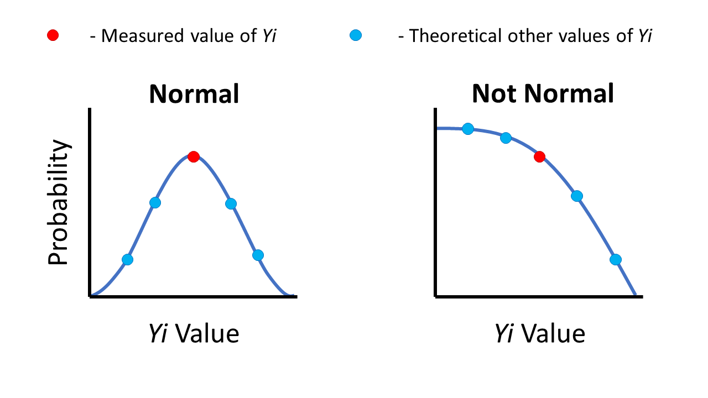
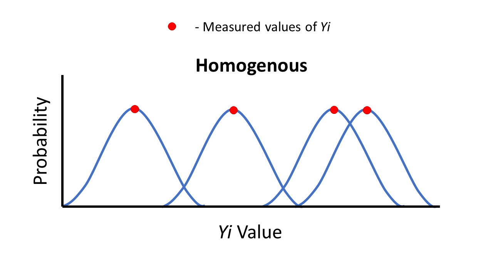
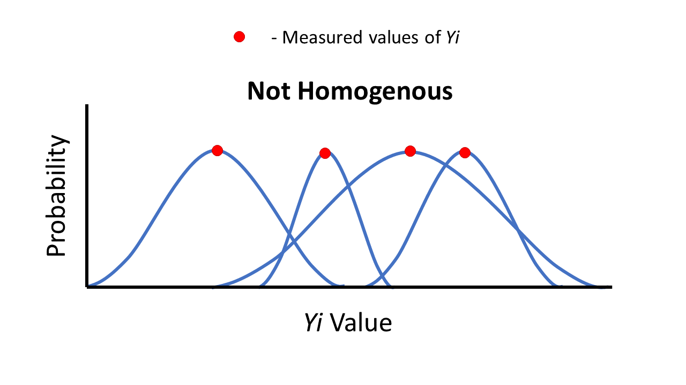

#Zurr, Chapter 2

Load useful Zuur functions.

```{r}
source("R/HighstatLibV10.R")
```

## Data

Nereis Diversicolour (worms) and nutrient datset

```{r}
data(Nereis)
```

## Data exploration

###Simple

####Cleaveland dotplots

Cleveland dotplot of concentration by order of observations (not interesting)

```{r}
dotchart(Nereis$concentration, xlab = "Concentration",
    ylab = "Order of observations",
    main = "Cleveland dotplot")
```

Cleveland dotplot of concentration grouped by nutrient type (more interesting)

```{r}
dotchart(Nereis$concentration,
groups = factor(Nereis$nutrient),
ylab = "Nutrient", xlab = "Concentration",
main = "Cleveland dotplot", pch = Nereis$nutrient)
```

C-DotPlots help identify outliers, where extreme values on the x axis are readily seen and the general spread of the
data both generally and within a group is visible. the above plot suggests that simple linear regression modelling might be a problem given:  
  
1. The spread of nutrient 3 is smaller than 2 & 1  
2. The mean concentration of nutirent 2 is larger than 1 & 3  
  
Therefore, nutrient type is likely to be important.  
  
####Pairplots
  
Pairplots are cool too:

```{r}
pairs(Nereis)
```

Nothing seems to be going on with concentration and biomass, however
there seems to be some relationship between concentration and nutrient
type.
  
####Boxplots
  
Boxplots also help, especially with getting a better idea of means,
standard deviations and pesky outliers.

```{r}
boxplot(concentration ∼ factor(nutrient),
varwidth = TRUE, xlab = "nutrient",
main = "Boxplot of concentration conditional on nutrient", ylab = "concentration", data = Nereis)
```

Again, this suggests some effect of nutrient type and concentration as per the previous two plots,
and highlights that there are many ways to skin a dataset in R. All this points to potential
problems with data heterogeneity.
  
###Less simple
  
First off, a new dataset about the worms distant cousin, the whale:
  
```{r}
data(TeethNitrogen)
```
  
#####XYPlots aka lattice graph aka trellis thingy
  
```{r}
library(lattice)
```
  
xyplots are handy for exploring how the relationship between two variables changes (or doesn't) depending
on the levels of a factor. In this case we're looking at the relationship between isotopic N content and estimated age obtained from the teeth rings of 10 whales and 1 award winning electronic music DJ that were stranded on a beach in scotland.  
  
Question: do all whales have similar N-age relationships?
  
```{r}
xyplot(X15N ~ Age | factor(Tooth), type = "l", col = 1,
  xlab = "Estimated age",
  ylab = expression(paste(delta^{15}, "N")),
  strip = function(bg = 'white', ...)
  strip.default(bg = 'white', ...),
  data = TeethNitrogen)
```

Answer: kind of...  
  
From the above figure we can see that some whales do have similar N-age relationships, but not all of them.
  
##Linear Regression Model (LRM)
  
Without going into too much detail, the bivariate LRM is defined as:  
  
  *Yi* = α + β × *Xi* + εi 
    
  where εi ~ N(0, σ2)  
    
*Yi* is the response (or dependent) variable  
*Xi* is the explanatory (or independent) variable  
The unexplained information is captured by the residuals εi and
these are assumed to be normally distributed with expectation 0 and variance σ2.
  
The parameters α and β are the population intercept and slope and are unknown.
  
The LRM attempts to estimate α and β along with confidence intervals.  
  
In most cases, the slope is the most interesting parameter as it gives 
us and idea of whether there is a relationship between *Yi* and *Xi* and if so,
the strength and direction of that relationship.
  
###Check your assumptions!
  
LRMs rely on a set of assumptions about the data used in the model as well
as the specification of the model itself. if these asusmptions are violated 
then the parameter estimates may be misleading or even completely wrong!  
  
This part of the reason why there are a bazillion types of regression model;
GLMs, GAMs,GLMMs, etc, etc, all have different underlying assumptions built into
them which allows them to be used in secnarios outside of the simple linear regression of *Yi* against *Xi*.
  
####Normality
  
*What is it?*  
  
Normality in this case refers to the assumption that for every value of *Xi*,
the probablility distribution for obtaining a different value of *Yi* is bell 
curve shaped.
  
For example at *X1* = 5 & *Y1* = 10, if we went back and measured *Y1* again  
when *X1* was still equal to 5, the probablility distribution of obtaining
a different value of *Y1* should be bell curve or normally distributed.
  
So getting a value of *Y1* = 11 or 9 would be similar to *Y1* = 10, but the 
probalility of getting *Y1* = 4 or *Y1* = 16 would be less, with the chances
of getting *Y1* = 1 or *Y1* = 19 being very unlikely. Roughly speaking.

Hopefully this figure will make it a bit clearer as well:



  
*Does it matter?*
  
Some authours argue that violations of normality isn't that serious on the basis of central limit theorem, some authors even...
  
*hang on, what's central limit theorem?*
  
It's a statistical theory that states that for large sample sizes,
the sample mean (the mean of your data) will be approximately equal 
to the population mean (the mean of your data + all the cases you didn't
/couldn't measure) regardless of the actual distrubution of the data.
  
*Ok continue/Huh? can we ask Kristin or Josh for a better explanation please?* (delete as appropriate)
  
...some authours also argue that if the sample size is large enough, 
normality is not even needed.
  
When checking for normality you should not base it on a histogram of
the raw data *unless* you have repeated observations for each *Xi* value,
instead, fit the model and inspect the residuals!
  
####Homogeneity 
  
*what is it?*
  
Remember those bell curve probablility distibutions for each value 
of X when asusming normality? Well the homogeneity assumption states that the spread of those bell curves is more or less consitent across all values of X.
  
For example, for the values *X1* = 5 & *Y1* = 10 and *X2* = 10 and *Y2* = 15,
if the probablity that *Y1* will increase by 5 if we went back and 
remeasured *X1* is the same as the probability that Y2 would increase by
5 when we remeasure *X2*, then the data are homogenous. If not, then the
data violates the assumption of homogeneity.
  
So this is homogenous:


  
But his isn't:



Unless you have multiple values of *Y* for each value of *X*, the best way to
check for heterogeneity is to plot the fitted values against the residuals
(data not explained by the model parameters), if the spread looks nice and 
even, you're set!*
  
*N.B: When it comes to statistics, you're never really "set", just less likely to be wrong*
  
*ok, so... does it matter?*
  
A little heterogenetiy doesn't hurt too much, but having a lot of it is a
serious problem. It means that the underlying theory behind the specified 
model is invalid, which also invalidates *p*-values and their ilk. 
  
However, you can deal with heterogeneity through data transformation! (yay!)
  
####Fixed-X
  
*What be fixed-X? Is it for finding treasure?*
  
No, The fixed-X assumption means that for your data, you knew the values
for each explanatory variable in advance. For experimental studies
where you fix variables such as temperature, toxin concentration or
exposure to Barry White's *Barry White Sings for Someone You Love*,
then you've got yourself some fixed X values, congratulations!  
  
Of course, in field based studies, this is rarely the case and arguably 
impossible (Unless you have any examples?).
  
*And if I violate this assumption?*
  
Typically it results in biased regression parameters, meaning that the
parameters values you get from the model don't match the population ("true")
value.
  
Thankfully this isn't an issue when the measurement error around *X* is smaller
than the range of *X* values. So if your Barryometer measurement error is typically around 0.1 Wht, but the range of values for recorded in the field is between 10 and 40 Wht, then the fixed-X assumption violation doesn't matter as much.
  
####Independence
  
*What is it?*
  
Independance refers to whether or not the value of *Yi* at a given *Xi* is effected by another *Xi* value. If it isn't, you're good, if not, you're not. Confused?
  
One example would be that if it rains 100m in the air, then it will also rain at
200m in the air. If height was our *X* and amount of rain our *Y*, then it's easy to see that the values of *Y* for a given height will be heavily influenced by other heights, and therefore not independent.
  
(Think of time and space!)
  
It can also occur through poor model selection/specification or through the structure  of the data itself, with one example being fitting a straight line through non-linearly related data. In this case plotting the residuals vs *X* will highlight a pattern where the residuals of similar *X* values will all be positive or negative, which violates the independence assumption.
  
*What is it good for?*
  
Absolutely nothing!
  
Not quite, violations of independence are the most serious as it invalidates tests such as the *F*-test and *t*-test.
  
If the violation is due to poor model specification or the structure of the data,
selecting a more appropriate model/transforming the data to linearise them usually works fine.
  
If it is due to things such as spatial or temporal effects, then it can be taken care of by incorporating a temporal or spatial dependance structure between the observations or residuals in the model (something I don't know how to do, but should probably learn)
  
###Examples of violations in ecological data
  
####Wedge Clams
  
Here's the clams data...
  
```{r}
data(Clams)
```
  
...consisting of five variables: month, length, ash free dry weight (AFD), Ln Length and Ln AFD.
  
A scatterplot of the untransformed length and AFD highlights a non-linear relationship:

```{r}
plot(Clams$LENGTH,Clams$AFD)
```

Uh-oh, that's a violation of independance!  
  
Thankfully log transforming fixes this:

```{r}
plot(Clams$LNLENGTH,Clams$LNAFD)
```

Much better.  
  
We can also plot it as a coplot with month...

```{r}
Clams$fMONTH <- factor(Clams$MONTH) #Manke month a factor
coplot(LNAFD ∼ LNLENGTH | fMONTH, data = Clams)
```

...which shows that the relationship is linear across all months. 
  
When specifying our model, it makes sense to include month as an interaction term given the biology of clams (i.e. spawning months)

```{r}
M1 <- lm(LNAFD ∼ LNLENGTH * fMONTH, data = Clams)
```

Using the drop1 function confirms that the interaction is significant:

```{r}
drop1(M1,test = "F")
```

But how are our assumptions holding up?
  

```{r}
op <- par(mfrow=c(2,2),mar=c(5,4,1,2))
#par(mfrow=c(2,2),mar=c(5,4,1,2))
plot(M1,add.smooth=F,which=1)
E<-resid(M1)
hist(E,xlab="Residuals",main="")
plot(Clams$LNLENGTH,E,xlab="Log(Length)",ylab="Residuals")
plot(Clams$fMONTH,E,xlab="Month",ylab="Residuals")
par(op)
```

The top-right panel suggests slight non-normality, and the other three suggest
the spread of the residuals is not the same across all lengths and months.  
  
To test this more formally we can use a series of formal tests to test them formally:  
  
  
1. *F*-test using the ratio of variences.
  
The bottomleft panel above suggests that values above 2.275 have 
a different spread to those below 2.275. By splitting the length
data into two groups we can use the *F*-ratio test to see if the
variences between the two groups are equal:
  
```{r}
E1 <- E[Clams$LNLENGTH <= 2.75] #subset 
E2 <- E[Clams$LNLENGTH > 2.75] # the groups
var.test(E1, E2)
```
  
*N.B: this output is different from the chapter output*
  
From the above test we obtain a *p*-value of 0.07, outside of our
5% confidence level and so we accpet the null hypothesis: both
sample variences are equal.
  
Of course, the cut off point of 2.275 is arbitrary, and the *p*-value
of 0.07 isn't excessively far away from 0.05, as always, caution
and logic when interpreting these tests is required.
  
  
2. Bartlett test of homogeneity of variences
  
Another formal test is the Bartlett test. Here the null hypothesis is 
that the variences in all months is the same:

```{r}
bartlett.test(E, Clams$fMONTH)
```
  
The super small *p*-value here suggests that we reject the null;
the variences between months is different.
  
One problem with this test however is that it is sensitive to violations
of normality.
  
The conclusion here is that there is a significant relationship between
biomass, length and month with a weak but significant interaction between
the length and month. However both the formal tests and graphs give us
reason to doubt the suitability of the model given the data.

####Whale Dentist

If we go back to the coplot we can see that for Moby, the isotope/nitrogen relationship seemsto approaximate a linear one... 

```{r}
xyplot(X15N ~ Age | factor(Tooth), type = "l", col = 1,
  xlab = "Estimated age",
  ylab = expression(paste(delta^{15}, "N")),
  strip = function(bg = 'white', ...)
  strip.default(bg = 'white', ...),
  data = TeethNitrogen)
```

...and therefore may be abe to be explored through a LRM.

```{r}
TN<-TeethNitrogen
tmp<-lm(X15N~Age,subset=TN$Tooth=="Moby",data=TN)

op <- par(mfrow=c(2,2))
plot(tmp,add.smooth=F)
par(op)
```

The above plots we (should) have all seen before. The top right plot suggests that the residuals are normally distributed, and the bottomright identifes potential outliers (none of the points cross the cooks distance line, so no outliers are identified here).

*On cook's distance...*

Leverage on the *X*-axis refers to a measure of wheher a observation has one or more extreme values of the explanatory variables associated with it. High leverage = large influece on the model and parameter estimates = potentially bad! As a rule of thumb, any obersvations with a cooks distance larger than 1 should be looked at further.
  
  
The top left panel shows a clear pattern in the residuals against the fitted values (very wavy), which suggests independance has been violated, however the spread of the residuals is even, suggesting homogeneity hasn't been violated. The bottom left panel also assesses homogeneity by square root transforming the residuals and weighting them by their leverage (how influential they are in the model), and also suggests homogeneity.

The non-independence is likely a temporal effect: high nitrogen concentrations at a younger age are likely to result in higher concentrations at a later age.


####Worms!

In this case the concentration is modelled as a function of both nutirent type, biomass and their interaction:

```{r}
Nereis$fbiomass=factor(Nereis$biomass)
Nereis$fnutrient=factor(Nereis$nutrient)
M3<-lm(concentration~fbiomass*fnutrient,data=Nereis)
```

The drop1 command shows that the interaction is significant at the 5% level:

```{r}
drop1(M3, test = "F")
```

However, the boxplots of the residuals versus nutirent and biomass show that homogeneity is violated:

```{r}
op <- par(mfrow=c(1,2))
plot(resid(M3)~Nereis$fbiomass,xlab="Biomass",
     ylab="Residuals")
plot(resid(M3)~Nereis$fnutrient,xlab="Nutrient",
     ylab="Residuals")
par(op)
```

Namely, the spread of the *Y* values around each *X* are different.

Transforming the concentration data may help, but that would also change the type of relationship between the *Y* and the explanatory variables. The end result suggests that the simple LRM approach is inadequate.

##Signing off

Zurr states that of the 15 real world datasets available for this book and the 20 available in his previous one, that no example of a simple linear regression could be found that didn't violate one or more assumptions in some way. This suggests that LRMs tend to be tricky to use for ecological data and instead require that you learn other modelling approaches to work with ecological data more successfully.


---